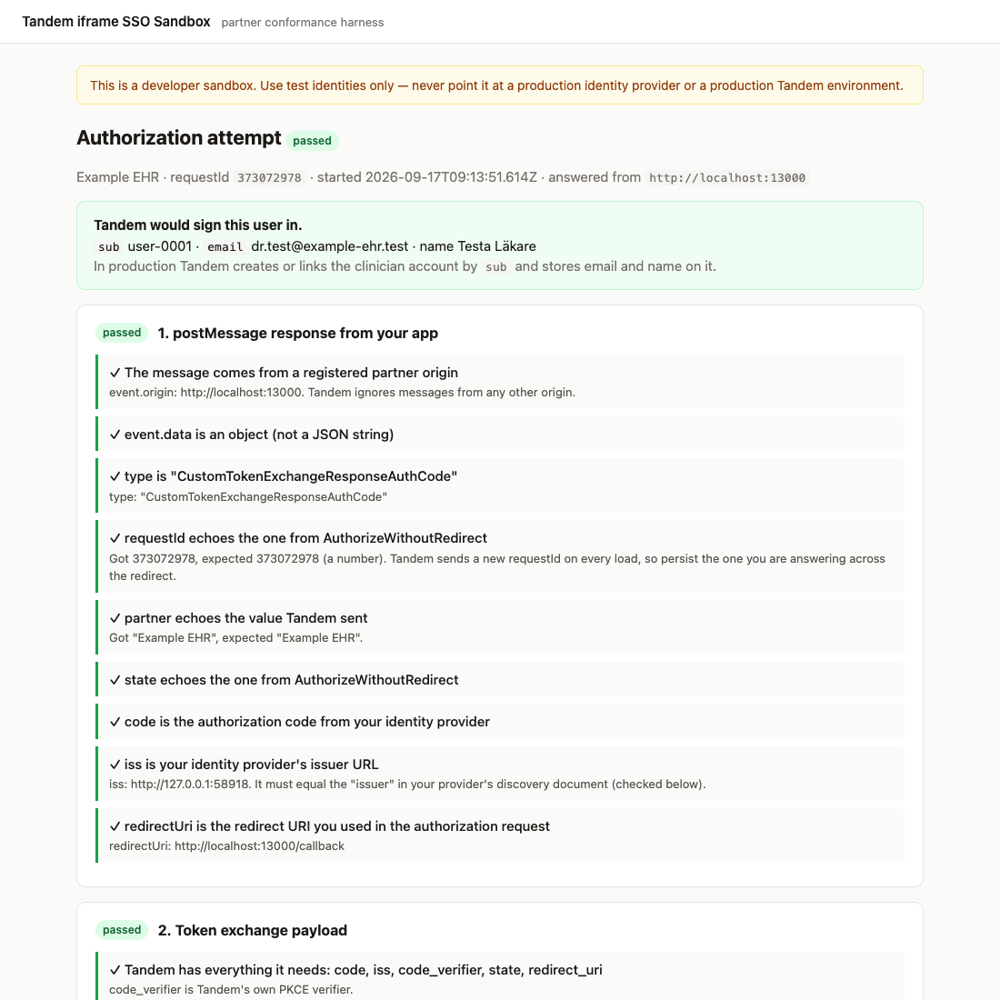
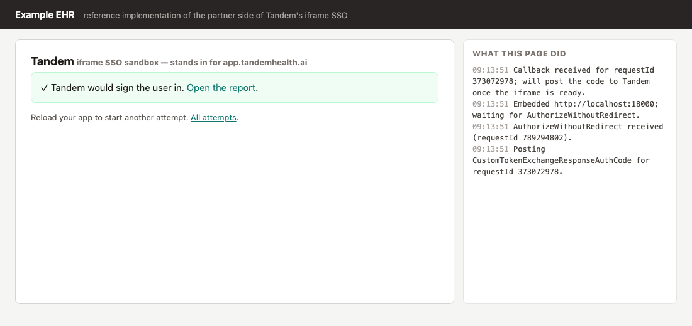

# Tandem iframe SSO Sandbox

A local stand-in for Tandem that lets you build and debug your side of the
iframe single sign-on flow described in Tandem's **iframe Authentication**
guide — on your own machine, against your own identity provider, without
involving Tandem.

In production your web app embeds `https://app.tandemhealth.ai` in an iframe.
Tandem asks your app to authenticate the user (`AuthorizeWithoutRedirect`), your
app sends the user through your OpenID Connect provider and hands the resulting
authorization code back (`CustomTokenExchangeResponseAuthCode`), and Tandem
exchanges that code with your provider to sign the user in.

The sandbox plays Tandem's part: it sends the same messages, applies the same
checks, performs the same token exchange against your provider using the same
parameters, and then — instead of signing anyone in — shows you a report of
every step, including the exact error Tandem would have produced.



**Use test identities only.** Never point the sandbox at a production identity
provider.

## Requirements

[Node.js](https://nodejs.org) 22 or newer. Nothing else: the sandbox has no
dependencies to install.

## Quick start

```bash
cp .env.example .env      # then fill in the values below
node sandbox/server.js    # serves http://localhost:8000
```

`.env` needs:

| Variable             | What to put there                                                                                                           |
| -------------------- | --------------------------------------------------------------------------------------------------------------------------- |
| `PARTNER_ORIGINS`    | The origin(s) of the app that will embed the iframe, e.g. `http://localhost:3000`                                           |
| `PARTNER_NAME`       | Any label; Tandem sends it as `partner` and expects it echoed back                                                          |
| `IDP_CLIENT_ID`      | Client id of the app registration you created for Tandem in your identity provider                                          |
| `IDP_CLIENT_SECRET`  | Its client secret. Stays on your machine; this is what you would otherwise share with Tandem                                |
| `IDP_WELL_KNOWN_URL` | Your provider's discovery document, e.g. `https://login.microsoftonline.com/<tenant>/v2.0/.well-known/openid-configuration` |

The app registration must allow the redirect URI of _your_ app's callback page
(the sandbox never receives the redirect itself).

### See it work before touching your own code

`partner-example/` is a reference implementation of the partner side, written
the way the guide describes. Run it alongside the sandbox:

```bash
node partner-example/server.js   # http://localhost:3000, embeds the sandbox
```

Open <http://localhost:3000>: it embeds the sandbox, receives
`AuthorizeWithoutRedirect`, sends you to your identity provider, and posts the
code back. The iframe then shows whether Tandem would have signed you in, with
a link to the report.

No identity provider at hand yet? The repo includes a tiny OpenID Connect
provider that signs everyone in as a fixed test user. It runs as a third
process, in its own terminal:

```bash
node test/mock-idp.js            # http://127.0.0.1:9000; prints the .env values to use
```

Put the printed values in `.env` (including `ALLOW_INSECURE_IDP=true`, since it
speaks plain http), then start the sandbox and the partner example. Both check
at startup that the identity provider is reachable and warn if it is not.

## Wiring it into your app

Follow the guide with two substitutions, both of which you want configurable
anyway to switch between Tandem environments:

- the iframe `src` becomes `http://localhost:8000/`
- `tandemOrigin` (the origin you check `event.origin` against and pass as the
  `postMessage` target) becomes `http://localhost:8000`

Then reload your app. Every load creates a new attempt on the sandbox; when your
app answers, the attempt completes and its report appears at
<http://localhost:8000/attempts>.

Once the sandbox gives you a passing report, switch `src` and `tandemOrigin` to
the Tandem environment Tandem gives you for the real end-to-end test. The
sandbox verifies your side; that step verifies Tandem's configuration for your
organisation.



## What the report checks

1. **Your `postMessage` response** — comes from a registered origin; is an
   object (not a JSON string); has `type: "CustomTokenExchangeResponseAuthCode"`;
   echoes `requestId`, `partner` and `state` exactly; carries `code`, `iss` and
   `redirectUri`.
2. **Token exchange payload** — Tandem has everything it needs.
3. **OpenID Connect discovery** — your discovery document is reachable and
   names `issuer`, `token_endpoint` and `userinfo_endpoint`; the `issuer`
   equals the `iss` you sent, byte for byte.
4. **Authorization code exchange** — Tandem posts to your token endpoint with
   `client_secret_post` authentication, your `redirect_uri`, and its PKCE
   `code_verifier`, and gets an `access_token`.
5. **User identity** — your `userinfo` endpoint returns a profile with `sub`
   (required), `email`, `given_name` and `family_name` (recommended).

Every HTTP exchange with your provider is recorded in the report, with
secrets, codes and tokens redacted.

## Message interface

Sent by Tandem to your app when the iframe loads (every load, so a new
`requestId` each time):

```ts
{
  type: "AuthorizeWithoutRedirect";
  requestId: number; // identifies this attempt; echo it back
  partner: string; // your partner label; echo it back
  clientId: string; // client id of Tandem's app registration in your IdP
  state: string; // OAuth state; pass through unchanged
  codeChallenge: string; // PKCE challenge to send to your IdP
  codeChallengeMethod: "S256";
}
```

Sent by your app to the iframe once your provider has redirected back:

```ts
{
  type: "CustomTokenExchangeResponseAuthCode";
  requestId: number; // from AuthorizeWithoutRedirect
  partner: string; // from AuthorizeWithoutRedirect
  state: string; // from AuthorizeWithoutRedirect
  code: string; // authorization code from your IdP
  iss: string; // your IdP's issuer, exactly as in its discovery document
  redirectUri: string; // the redirect_uri you used in the authorization request
}
```

Because the redirect to your provider reloads your page, persist `requestId`,
`state`, `partner` and `redirectUri` (for example in `localStorage`) before
redirecting and read them back on the callback. `partner-example/static/partner.js`
shows one way to do it.

## Configuration reference

| Variable             | Default                 | Purpose                                                               |
| -------------------- | ----------------------- | --------------------------------------------------------------------- |
| `PARTNER_ORIGINS`    | `http://localhost:3000` | Comma-separated origins allowed to embed the sandbox and message it   |
| `PARTNER_NAME`       | `partner`               | Value of `partner` in the messages                                    |
| `IDP_CLIENT_ID`      | —                       | Required                                                              |
| `IDP_CLIENT_SECRET`  | —                       | Required; server-side only                                            |
| `IDP_WELL_KNOWN_URL` | —                       | Required; must be `https://`                                          |
| `SANDBOX_PORT`       | `8000`                  |                                                                       |
| `SANDBOX_HOST`       | `127.0.0.1`             | Keep it local: anyone who can reach the port can drive attempts       |
| `ALLOW_INSECURE_IDP` | `false`                 | Permit an `http://` provider (the mock IdP). Tandem itself never does |

Attempts live in memory; restarting the sandbox clears them.

## Development

```bash
npm install                        # dev tooling only (tests, type checking, formatting)
npm test                           # node:test — protocol, exchange and server tests against the mock IdP
npm run check                      # tsc --checkJs
npm run format
npx playwright install chromium    # once
npm run e2e                        # real browser: partner example → mock IdP → sandbox → report
```

See `AGENTS.md` for how the sandbox tracks Tandem's real token exchange.

## Licence

Provided by Tandem Health AB for partners testing an integration with Tandem.
You may clone, run and locally adapt it for that purpose; redistribution and
other uses are not permitted. See [LICENSE](LICENSE). Security reports:
[SECURITY.md](SECURITY.md).
